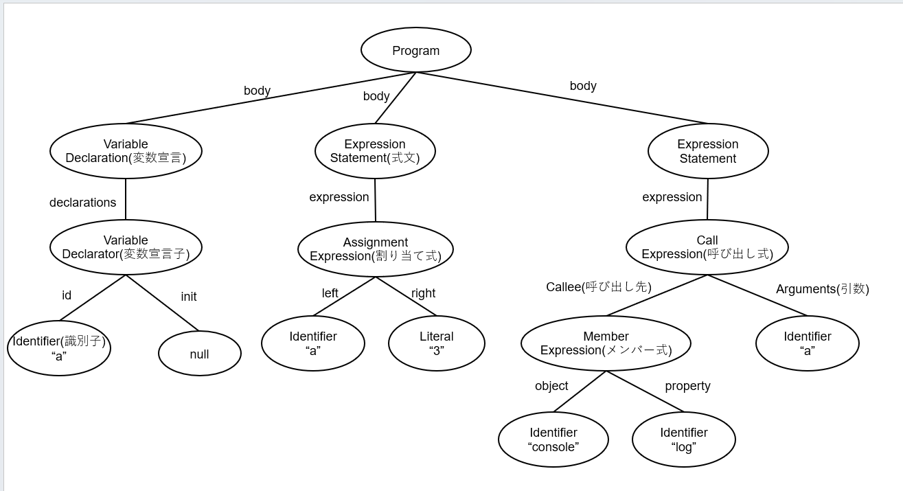

# AST結果(JSON)

## source01

```
let a
a
=
3
console.log(a)
```

の場合

```JSON
{
  "type": "Program",
  "start": 0,
  "end": 26,
  "body": [
    {
      "type": "VariableDeclaration",
      "start": 0,
      "end": 5,
      "declarations": [
        {
          "type": "VariableDeclarator",
          "start": 4,
          "end": 5,
          "id": {
            "type": "Identifier",
            "start": 4,
            "end": 5,
            "name": "a"
          },
          "init": null
        }
      ],
      "kind": "let"
    },
    {
      "type": "ExpressionStatement",
      "start": 6,
      "end": 11,
      "expression": {
        "type": "AssignmentExpression",
        "start": 6,
        "end": 11,
        "operator": "=",
        "left": {
          "type": "Identifier",
          "start": 6,
          "end": 7,
          "name": "a"
        },
        "right": {
          "type": "Literal",
          "start": 10,
          "end": 11,
          "value": 3,
          "raw": "3"
        }
      }
    },
    {
      "type": "ExpressionStatement",
      "start": 12,
      "end": 26,
      "expression": {
        "type": "CallExpression",
        "start": 12,
        "end": 26,
        "callee": {
          "type": "MemberExpression",
          "start": 12,
          "end": 23,
          "object": {
            "type": "Identifier",
            "start": 12,
            "end": 19,
            "name": "console"
          },
          "property": {
            "type": "Identifier",
            "start": 20,
            "end": 23,
            "name": "log"
          },
          "computed": false,
          "optional": false
        },
        "arguments": [
          {
            "type": "Identifier",
            "start": 24,
            "end": 25,
            "name": "a"
          }
        ],
        "optional": false
      }
    }
  ],
  "sourceType": "script"
}

```

## source02

```
let a; a = 3; console.log(a);
```

の場合

```JSON
{
  "type": "Program",
  "start": 0,
  "end": 29,
  "body": [
    {
      "type": "VariableDeclaration",
      "start": 0,
      "end": 6,
      "declarations": [
        {
          "type": "VariableDeclarator",
          "start": 4,
          "end": 5,
          "id": {
            "type": "Identifier",
            "start": 4,
            "end": 5,
            "name": "a"
          },
          "init": null
        }
      ],
      "kind": "let"
    },
    {
      "type": "ExpressionStatement",
      "start": 7,
      "end": 13,
      "expression": {
        "type": "AssignmentExpression",
        "start": 7,
        "end": 12,
        "operator": "=",
        "left": {
          "type": "Identifier",
          "start": 7,
          "end": 8,
          "name": "a"
        },
        "right": {
          "type": "Literal",
          "start": 11,
          "end": 12,
          "value": 3,
          "raw": "3"
        }
      }
    },
    {
      "type": "ExpressionStatement",
      "start": 14,
      "end": 29,
      "expression": {
        "type": "CallExpression",
        "start": 14,
        "end": 28,
        "callee": {
          "type": "MemberExpression",
          "start": 14,
          "end": 25,
          "object": {
            "type": "Identifier",
            "start": 14,
            "end": 21,
            "name": "console"
          },
          "property": {
            "type": "Identifier",
            "start": 22,
            "end": 25,
            "name": "log"
          },
          "computed": false,
          "optional": false
        },
        "arguments": [
          {
            "type": "Identifier",
            "start": 26,
            "end": 27,
            "name": "a"
          }
        ],
        "optional": false
      }
    }
  ],
  "sourceType": "script"
}
```

## ASTの生成画像

 
